# 아키텍처 다이어그램

> **2026-07-26 기준 — v1.2.0(D-055 ~ D-069)에 맞춰 갱신.** Mermaid 문법으로 작성.
> GitHub, VSCode (Mermaid 확장), [Mermaid Live Editor](https://mermaid.live)에서 렌더링 가능.
>
> **구성**: 13개 다이어그램 — 데이터 모델·스키마(1·3·7), 시스템·모듈(2·8),
> 처리 엔진(4·5), 워크플로우(6·12·13), 저장소·의존(9·10), 화면(11)
>
> **이번 판에서 손댄 곳**
>
> | 다이어그램 | 무엇이 바뀌었나 |
> |---|---|
> | 6 · 11 · 13 | 추출 모드와 화면 구조 — 전면 개작. 13번은 새로 만든 것 |
> | 1 · 5 · 9 · 10 | 텍스트 레이어 PDF 산출, 쪽 전면 1블록, 부분 재-OCR, 되돌리기 |
> | 2 · 8 | 라우트 217개 · JS 모듈 32개 · API 캐시 금지 미들웨어 |
> | 4 | LLM 사용량을 화면에 표시(D-056), LLM Vision OCR을 소비자로 추가 |
> | 3 · 7 · 12 | **v1.3.0에서 바뀜** — 코어 엔티티가 6종으로(경계 목록 추가 D-092, Work 삭제 D-099), 경계 목록은 **원본 저장소**에 산다(D-097). 스키마 19개, L7 주석 4단계는 그대로 |
>
> 그림과 코드가 어긋나면 **코드가 기준**이다.

---

## 1. 8층 데이터 모델

원본 저장소(L1-L4, 단일 정본)와 해석 저장소(L5-L8, 다수 병존)의 구조.
저장소 경계에서 `dependency.json`이 변경을 추적한다.

**여기서 읽어야 할 것**: v1.2.0은 층을 더하지 않았다. 8층은 그대로이고,
L2·L4를 읽어 `exports/`로 나가는 **출구**가 하나 생겼을 뿐이다.
추출 모드도 새 층이 아니라 화면 표시 방식일 뿐이다.

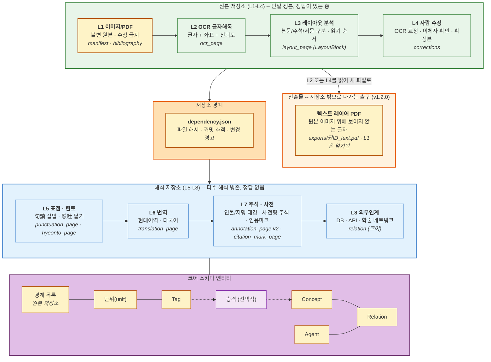

**핵심 원칙:**
- 원본 저장소는 **단일 정본**으로 수렴 (정답이 있다)
- 해석 저장소는 **다수 병존** (해석은 연구자마다 다르다)
- L4 확정 → `dependency.json` → 해석 저장소 시작점 (저장소 경계)
- 코어 스키마 6개(단위(unit — 보기), Boundaries(경계 목록 — 단위의 정본, D-092), Tag, Concept, Agent, Relation).
  경계 목록은 원본 저장소에 살고(D-097) 나머지는 해석 저장소 안에 있다
- **추출 모드는 층이 아니라 표시 프로필**이다 — 어떤 탭을 보여 줄지만 바뀌고,
  그 상태는 브라우저 `localStorage`(`ctb.profile.<문헌ID>`)에만 남는다.
  `manifest.json`에는 아무것도 기록되지 않으므로 저장되는 데이터는 교감 모드와 완전히 같다 (D-055 · D-060)
- 산출물 `exports/`는 **새 파일**이다 — `L1_source/`는 어떤 경우에도 수정하지 않는다 (D-062 · D-068)

---

## 2. 전체 시스템 아키텍처

프론트엔드(32개 JS 모듈) · 백엔드(FastAPI + 9 라우터, 라우트 217개) ·
처리 엔진(OCR 5종 + LLM 5단 + 산출·검출 보조) · Git 저장소 · 외부 서비스.

**여기서 읽어야 할 것**: 화면과 서버 사이에는 REST API 하나뿐이고 빌드 도구도
프레임워크도 없다. v1.2.0에서 서버가 API 응답에 캐시 금지를 붙여
「고쳤는데 화면이 그대로」를 원천 차단한다 — 호출부 47곳이 아니라 미들웨어 한 곳에서다(D-066).

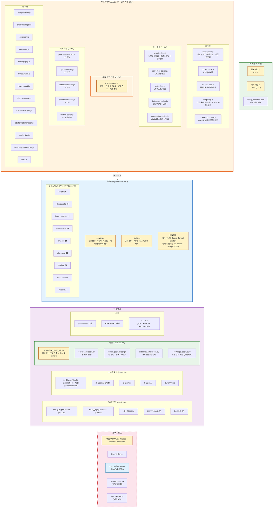

**역할 분리:**
- **Git**: 저장, 이력, 버전, diff → 이미 있는 인프라
- **앱**: 관계, 의미, 경고, UI → 만들어야 할 것
- **원격 호스팅**: 백업, 동기화 → 교체 가능
- **오프라인 퍼스트**: 핵심 작업(교정, 열람, 커밋)은 인터넷 없이 완전히 동작

---

## 3. 코어 스키마 엔티티 관계 (ER Diagram)

해석 저장소 내부의 6개 엔티티 모델. core-schema-v1.3 기준.
모든 엔티티는 `draft → active → deprecated → archived` 상태 전이를 따른다 (삭제 금지).

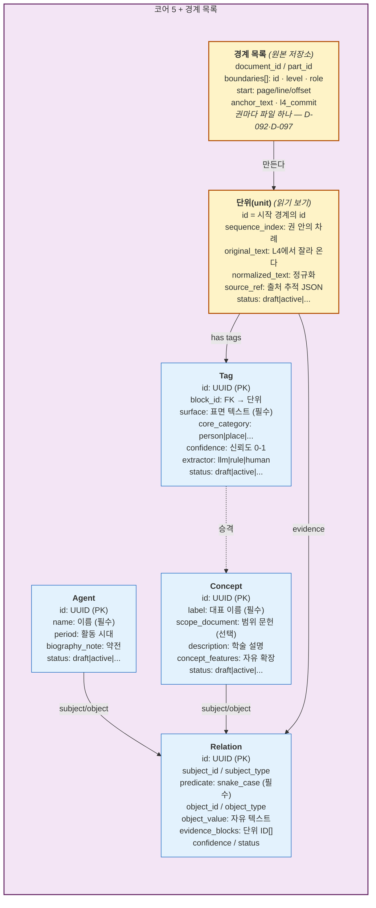

**설계 보장:**
- 구조(Structure) ≠ 해석(Interpretation) — 코어는 구조만 저장
- 온톨로지 잠금 없음 — Concept의 `concept_features`는 자유 확장
- Tag → Concept 승격은 연구자 판단 (선택적, Promotion Flow)
- Predicate는 snake_case, 구조적 행위만 (해석 배제)
- `source_ref`로 원본 저장소 역참조 (document_id + page + layout_block_id + git commit)

---

## 4. LLM 5단 폴백 아키텍처

전체 프로젝트 공용 LLM 연동. `src/llm/router.py`가 단일 진입점.
자동으로 1순위부터 시도, 실패 시 다음으로 폴백.

**여기서 읽어야 할 것**: 순서는 무료 → 저렴 → 최후 폴백이다.
v1.2.0에서 달라진 것은 폴백 구조가 아니라 **투명성**이다 —
어느 모델로 몇 번 불렀고 얼마가 나갔는지가 화면에 표시된다(D-056).

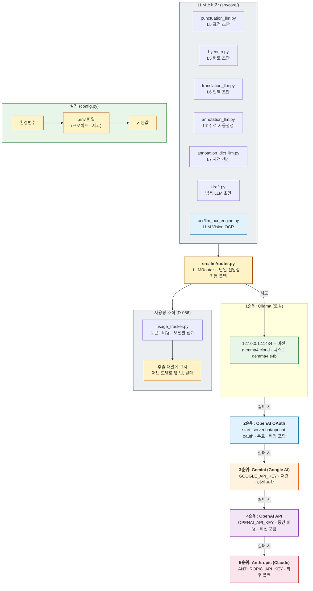

**LLM 협업 패턴 (2-8층 공통):**
1. LLM이 draft 생성
2. 사람이 review
3. 사람이 commit (Git 자동 저장)

---

## 5. OCR 엔진 파이프라인

5개 OCR 엔진의 레지스트리 기반 자동 선택. LayoutBlock 단위로 이미지 크롭 → 전처리 → 인식 → 후처리.

**여기서 읽어야 할 것**: 파이프라인의 입구는 언제나 L3 LayoutBlock이다.
v1.2.0은 그 계약을 바꾸지 않았다 — 대신 입구를 자동으로 채우고(쪽 전면 1블록),
다시 돌릴 쪽을 골라내고(재-OCR 판정), 덮어쓰기 직전 상태를 남기는(되돌리기)
보조 모듈을 그 앞뒤에 붙였다. 출구에는 텍스트 레이어 PDF 산출이 새로 붙었다.

```mermaid
flowchart LR
    subgraph INPUT["입력"]
        IN1["L1 이미지/PDF<br/>페이지 단위"]
        IN2["L3 LayoutBlock<br/>영역 · 읽기순서 · block_type"]
    end

    subgraph PREP["입구 채우기 (v1.2.0)"]
        direction TB
        PR1["full_page_block.py<br/>L3가 없으면 쪽 전면 1블록을 만든다<br/><i>사람이 사각형을 그리지 않는다 -- D-067</i>"]
        PR2["layout_staleness.py<br/>L3가 OCR 이후에 바뀐 쪽만 골라낸다<br/><i>부분 재-OCR -- D-057</i>"]
    end

    subgraph REGISTRY["OCR 레지스트리 (registry.py)"]
        REG["자동 등록<br/>우선순위 기반 선택<br/>엔진 불가시 폴백"]
    end

    subgraph ENGINES["OCR 엔진 (우선순위순)"]
        direction TB
        E1["<b>1.</b> NDL古典籍OCR Full<br/><i>TrOCR · RTMDet · GPU 권장</i>"]
        E2["<b>2.</b> NDL古典籍OCR-Lite<br/><i>ONNX 경량 · CPU 가능</i>"]
        E3["<b>3.</b> NDLOCR-Lite<br/><i>현대/인쇄 · ParseQ · DEIM</i>"]
        E4["<b>4.</b> LLM Vision OCR<br/><i>LLM 비전 모델 활용</i>"]
        E5["<b>5.</b> PaddleOCR<br/><i>다국어 · 멀티라인</i>"]
    end

    subgraph PIPELINE["파이프라인 (pipeline.py)"]
        direction TB
        P1["이미지 크롭<br/>(LayoutBlock bbox)"]
        P2["전처리<br/>(BGR/RGB · 리사이즈)"]
        P3["글자 인식<br/>(엔진별 추론)"]
        P4["후처리<br/>(신뢰도 필터 · 좌표 매핑)"]
        P1 --> P2 --> P3 --> P4
    end

    subgraph OUTPUT["출력"]
        OUT1["<b>L2 OcrResult</b><br/>ocr_page.json"]
        OUT2["OcrLine → OcrCharacter<br/>char · bbox · confidence"]
    end

    subgraph ORDERING["읽기 순서"]
        OR1["XY-Cut 알고리즘"]
        OR2["Smooth Ordering"]
        OR3["割注 블록 감지"]
    end

    subgraph SAFE["되돌리기 (v1.2.0 · D-065)"]
        SF1["page_backup.py<br/>덮어쓰기 직전 L2 + L4를 한 벌 남긴다<br/><i>문헌/.page_backup/ · Git 이력과 무관 · 한 세대만</i>"]
    end

    subgraph DOWN["산출 (v1.2.0)"]
        direction TB
        DN2["line_detector.py<br/>엔진이 좌표를 안 주면 줄 위치를 검출"]
        DN1["export/text_layer_pdf.py<br/>보이지 않는 텍스트 + 폰트 임베드<br/>만든 뒤 다시 열어 잰다"]
        DN2 --> DN1
    end

    INPUT --> PREP --> REGISTRY --> ENGINES --> PIPELINE --> OUTPUT
    OUTPUT --- ORDERING
    OUTPUT --- SAFE
    OUTPUT --> DOWN

    style INPUT fill:#fff3e0,stroke:#e65100,stroke-width:2px
    style REGISTRY fill:#fff3e0,stroke:#e65100,stroke-width:2px
    style REG fill:#fef3c7,stroke:#b45309,stroke-width:2px
    style ENGINES fill:#fce4ec,stroke:#c62828,stroke-width:2px
    style PIPELINE fill:#e8f5e9,stroke:#2e7d32,stroke-width:2px
    style OUTPUT fill:#fce4ec,stroke:#c62828,stroke-width:2px
    style OUT1 fill:#fef3c7,stroke:#b45309,stroke-width:2px
    style ORDERING fill:#eceff1,stroke:#546e7a,stroke-width:2px
    style PREP fill:#e8f5e9,stroke:#2e7d32,stroke-width:2px
    style SAFE fill:#eceff1,stroke:#546e7a,stroke-width:2px
    style DOWN fill:#fff3e0,stroke:#e65100,stroke-width:2px
    style DN1 fill:#fef3c7,stroke:#b45309,stroke-width:2px
```

---

## 6. 사용자 워크플로우

연구자의 작업 흐름은 v1.2.0부터 **두 갈래**다. 문헌을 열 때 고르는 작업 모드가
그 갈래를 정한다 — 고서를 한 글자씩 다루는 「교감 모드」와,
근현대 논문에서 텍스트만 뽑는 「추출 모드」다.

**여기서 읽어야 할 것**: 두 갈래는 **같은 데이터**를 쓴다. 추출 모드는 저장 형식을
바꾸지 않고 거쳐야 할 단계와 화면을 줄일 뿐이므로, 언제든 모드를 바꿔
반대쪽 흐름을 이어서 할 수 있다. 어느 쪽으로 가든 관리 기능은 공통이다.

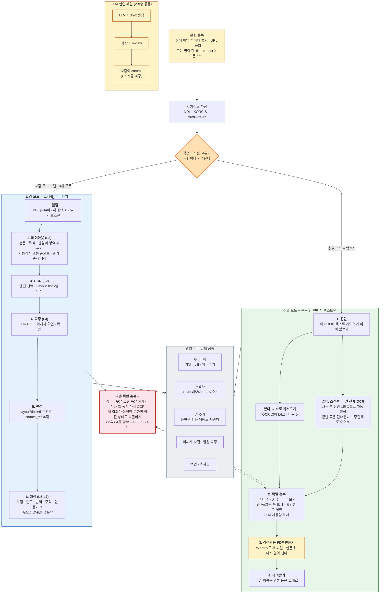

**두 갈래의 차이는 화면뿐이다:**
- 추출 모드에서 숨는 것은 상단 탭 7개(편성 · 표점 · 현토 · 번역 · 주석 · 인용 · 이체자)와
  사이드바 패널 6개(Git 이력 · 검증 · 의존 · 엔티티 · 비고 · 인용 양식)다
- 숨기는 것은 표시뿐이고 모드 · 패널 · 데이터는 그대로 남는다
- 프로필은 문헌마다 브라우저에 기억된다 — 한 서고에 고서와 논문이 섞여도 된다

---

## 7. 스키마 간 참조 관계도

19개 스키마(원본 7 + 해석 5 + 코어 6 + 교환 1)의 연결 구조.
화살표는 참조 방향: A → B = 「A가 B를 참조」.

```mermaid
flowchart TB
    subgraph SRC_SCHEMA["원본 저장소 스키마 (7개)"]
        direction TB
        S_MAN["<b>manifest</b><br/><i>document_id, parts, completeness_status</i>"]
        S_BIB["<b>bibliography</b><br/><i>서지정보, raw_metadata, _mapping_info</i>"]
        S_OCR["<b>ocr_page</b><br/><i>OcrResult · char, bbox, confidence</i>"]
        S_LAY["<b>layout_page</b><br/><i>LayoutBlock · block_id, bbox, reading_order</i>"]
        S_COR["<b>corrections</b><br/><i>Correction · type, original_ocr, corrected</i>"]
        S_IMP["<b>interp_manifest</b><br/><i>interpretation_id, source_document_id</i>"]
        S_DEP["<b>dependency</b><br/><i>source.base_commit, tracked_files, status</i>"]
    end

    subgraph INT_SCHEMA["해석 저장소 스키마 (5개)"]
        direction TB
        I_PUN["<b>punctuation_page</b><br/><i>block_id, marks, target, before/after</i>"]
        I_HYE["<b>hyeonto_page</b><br/><i>block_id, annotations, position, text</i>"]
        I_TRA["<b>translation_page</b><br/><i>source, translations, status, annotation_context</i>"]
        I_ANN["<b>annotation_page v2</b><br/><i>blocks, annotations, dictionary, generation_history</i>"]
        I_CIT["<b>citation_mark_page</b><br/><i>marks, source, marked_from, citation_override</i>"]
    end

    subgraph CORE_SCHEMA["코어 스키마 (6개)"]
        direction TB
        C_BND["<b>경계 목록</b><br/><i>원본 저장소 · 권마다 하나</i>"]
        C_TB["<b>단위(unit)</b><br/><i>경계의 읽기 보기 · original_text는 L4에서</i>"]
        C_TAG["<b>Tag</b><br/><i>block_id, surface, core_category</i>"]
        C_CON["<b>Concept</b><br/><i>label, concept_features</i>"]
        C_AGE["<b>Agent</b><br/><i>name, period</i>"]
        C_REL["<b>Relation</b><br/><i>subject, predicate, object, evidence_blocks</i>"]
    end

    subgraph EXCHANGE["교환 형식 (1개)"]
        EX["<b>exchange</b><br/><i>단일 JSON 스냅샷 · 내보내기/가져오기</i>"]
    end

    S_LAY --> S_MAN
    S_OCR --> S_MAN
    S_OCR --> S_LAY
    S_COR --> S_LAY
    S_IMP --> S_MAN
    S_DEP --> S_MAN
    I_PUN --> S_LAY
    I_HYE --> S_LAY
    I_TRA --> S_LAY
    I_ANN --> S_LAY
    I_CIT --> S_LAY
    I_TRA <-->|"annotation_context"| I_ANN
    C_TB --> C_WOR
    C_TAG --> C_TB
    C_TAG -.->|"승격"| C_CON
    C_REL --> C_AGE
    C_REL --> C_CON
    C_REL --> C_TB
    C_TB -.->|"source_ref 역참조"| S_MAN

    style SRC_SCHEMA fill:#fff3e0,stroke:#e65100,stroke-width:2px
    style S_MAN fill:#fef3c7,stroke:#b45309,stroke-width:2px
    style INT_SCHEMA fill:#e3f2fd,stroke:#1565c0,stroke-width:2px
    style CORE_SCHEMA fill:#f3e5f5,stroke:#7b1fa2,stroke-width:2px
    style EXCHANGE fill:#e8f5e9,stroke:#2e7d32,stroke-width:2px
    style EX fill:#fef3c7,stroke:#b45309,stroke-width:2px
```

**참조 패턴 요약:**
- 원본 내부: `layout_page/ocr_page` → `manifest`, `ocr_page/corrections` → `layout_page`
- 저장소 간: `interp_manifest/dependency` → `manifest` (document_id + base_commit)
- 해석→원본: 모든 해석 스키마 → `layout_page` (block_id로 연결)
- 해석 내부: `translation_page` ↔ `annotation_page` (annotation_context)
- 코어→원본: `단위(unit).source_ref` → `manifest` (역참조)

---

## 8. 백엔드 모듈 의존 구조

`server.py`(조립) → 9개 라우터 → `_state.py`(공유 상태) → core/llm/ocr/export 모듈.
라우터 간 직접 import 금지. `_state.py`가 lazy import로 순환 방지.

**여기서 읽어야 할 것**: 새 기능은 새 라우터를 만들지 않고 기존 도메인 라우터에 붙었다.
v1.2.0에서 늘어난 27개 라우트는 `documents`(텍스트 레이어 진단 · 가져오기 · PDF 산출 · 권 추가)와
`llm_ocr`(권 단위 일괄 OCR · 되돌리기 · 훑어보기)에 몰려 있다.

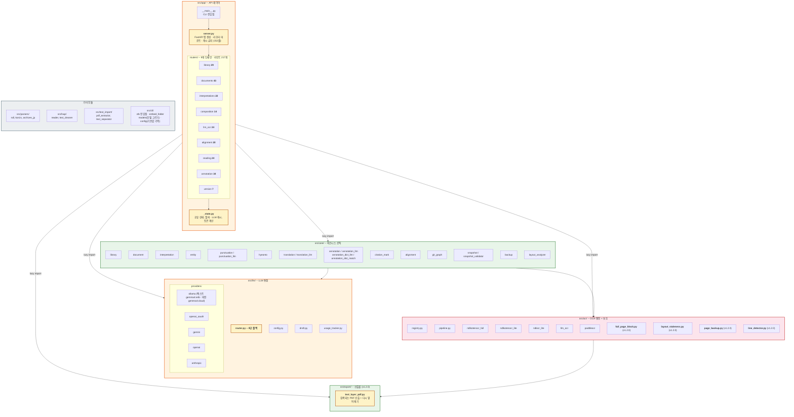

**규칙:**
- 라우터 간 직접 import 금지 → 공유 로직은 `_state.py`에 배치
- `_state.py`는 core/llm/ocr/export 모듈을 lazy import (순환 방지)
- Pydantic 모델은 사용하는 라우터 파일 내부에 정의
- JSON 저장은 반드시 `core.document.write_json_atomic()` — 저장 도중 죽으면
  `manifest.json`이 빈 파일이 되어 문헌이 통째로 열리지 않는다 (D-069)

---

## 9. Git 저장소 모델

하나의 원본 저장소 위에 여러 해석 저장소가 독립 Git 리포로 병존.
`library_manifest.json`이 서고 전체 지도 역할.

**여기서 읽어야 할 것**: v1.2.0에서 문헌 폴더 안에 두 개가 늘었다 —
밖으로 내보낼 산출물을 담는 `exports/`와, 되돌리기용 `.page_backup/`이다.
둘 다 **Git 이력과는 다른 층위**다. 되돌리기는 커밋을 되감는 것이 아니라
직전 파일 한 벌을 되돌려 놓는 것이고, 남기는 세대는 하나뿐이다.

```mermaid
flowchart TB
    subgraph LIBRARY["서고 (library_manifest.json)"]
        LIB["<b>library_manifest.json</b><br/>서고 전체 지도 · 문헌 목록, 해석 목록"]
    end

    subgraph SRC_REPO["원본 저장소 (Git repo)"]
        direction TB
        SR_MAN["manifest.json<br/>document_id, parts (권은 나중에 더할 수 있다)"]
        SR_L1["<b>L1_source/</b><br/>PDF, 이미지 (불변)"]
        SR_L2["L2_ocr/<br/>ocr_page JSON"]
        SR_L3["L3_layout/<br/>layout_page JSON"]
        SR_L4["L4_text/<br/>corrections JSON · 교정 텍스트"]
        SR_BIB["bibliography.json"]
        SR_EXP["<b>exports/</b> (v1.2.0)<br/>텍스트 레이어 PDF -- 밖으로 내보내는 산출물"]
        SR_BAK["<b>.page_backup/</b> (v1.2.0)<br/>덮어쓰기 직전 L2 + L4 한 벌<br/><i>로컬 되돌리기 · Git 이력과 무관 · 한 세대만</i>"]
        SR_GIT["Git 이력: commit, diff, log"]
    end

    subgraph REMOTE["원격 호스팅 (선택)"]
        REM["GitHub / GitLab / Gitea<br/>← push/pull →"]
    end

    subgraph INTERP_A["해석 A (연구자 김, Git repo)"]
        direction TB
        IA_MAN["interp_manifest.json -- interpreter: 김"]
        IA_DEP["<b>dependency.json -- base_commit 추적</b>"]
        IA_L5["L5/<br/>punctuation, hyeonto"]
        IA_L6["L6/<br/>translation"]
        IA_L7["L7/<br/>annotation, citation"]
        IA_CORE["core/ -- 경계 목록, 단위(unit), Tag, Concept, Agent, Relation"]
    end

    subgraph INTERP_B["해석 B (LLM draft, Git repo)"]
        direction TB
        IB_MAN["interp_manifest.json -- interpreter: LLM"]
        IB_DEP["dependency.json"]
        IB_L5["L5/"]
        IB_L6["L6/ LLM 번역"]
    end

    subgraph INTERP_C["해석 C (공동연구, Git repo)"]
        direction TB
        IC_MAN["interp_manifest.json -- interpreter: 팀"]
        IC_DEP["dependency.json"]
        IC_L5["L5/"]
        IC_L6["L6/"]
        IC_L7["L7/"]
    end

    LIBRARY --> SRC_REPO
    LIBRARY --> INTERP_A
    LIBRARY --> INTERP_B
    LIBRARY --> INTERP_C
    IA_DEP -.->|"base_commit"| SRC_REPO
    IB_DEP -.->|"base_commit"| SRC_REPO
    IC_DEP -.->|"base_commit"| SRC_REPO
    SRC_REPO <-->|"push/pull"| REMOTE

    style LIBRARY fill:#fff3e0,stroke:#e65100,stroke-width:2px
    style LIB fill:#fef3c7,stroke:#b45309,stroke-width:2px
    style SRC_REPO fill:#e8f5e9,stroke:#2e7d32,stroke-width:2px
    style SR_L1 fill:#fef3c7,stroke:#b45309,stroke-width:2px
    style SR_EXP fill:#fff3e0,stroke:#e65100,stroke-width:2px
    style SR_BAK fill:#eceff1,stroke:#546e7a,stroke-width:2px
    style REMOTE fill:#eceff1,stroke:#546e7a,stroke-width:2px,stroke-dasharray: 5 5
    style INTERP_A fill:#e3f2fd,stroke:#1565c0,stroke-width:2px
    style IA_DEP fill:#fef3c7,stroke:#b45309,stroke-width:2px
    style INTERP_B fill:#e8eaf6,stroke:#3f51b5
    style INTERP_C fill:#ede7f6,stroke:#5e35b1
    style IA_CORE fill:#f3e5f5,stroke:#7b1fa2
```

---

## 10. 층별 의존 관계

하위층 변경이 상위층에 미치는 영향. `dependency.json`의 `dependency_status` 상태 전이.

**여기서 읽어야 할 것**: 원본 저장소 안에는 v1.2.0에서 **거꾸로 가는 화살표**가 하나 생겼다.
레이아웃(L3)을 고치면 그 쪽의 OCR(L2)이 낡은 것이 되는데, 예전에는 사용자가
그것을 기억해 쪽 번호를 입력해야 했다. 이제 기계가 찾아낸다.

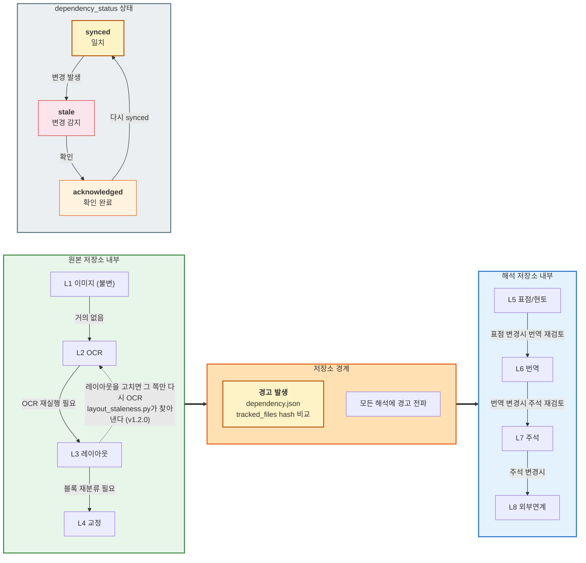

---

## 11. 프론트엔드 UI 구조

VSCode 스타일 화면. 왼쪽(액티비티 바 + 사이드바) · 가운데(원본 뷰어) ·
오른쪽(작업 패널), 그리고 그 위에 상단 작업 탭 10개.

**여기서 읽어야 할 것**: v1.2.0에서 **하단 패널이 사라졌다.** 거기 있던
Git 이력 · 검증 · 의존 추적 · 엔티티 · 비고는 모두 왼쪽 액티비티 바의
사이드바로 옮겨졌다. 그리고 추출 모드에서는 「추출 모드에서 숨음」이라고
적힌 것들이 통째로 숨는다 — 탭 7개와 사이드바 패널 6개다.
숨는 것은 표시뿐이고, 데이터와 API는 그대로 남아 있다.

```mermaid
flowchart TB
    subgraph TABS["상단 작업 탭 -- 모두 10개"]
        direction LR
        T_KEEP["<b>추출 모드에도 남는 셋</b><br/>열람 · 레이아웃 · 교정<br/><i>원본을 보고, 드물게 영역을 나누고, 결과를 손본다</i>"]
        T_HIDE["<b>추출 모드에서 숨는 일곱</b><br/>편성 · 표점 · 현토 · 번역 · 주석 · 인용 · 이체자"]
    end

    subgraph LAYOUT["3영역 레이아웃"]
        direction LR
        subgraph LEFT["왼쪽: 액티비티 바 + 사이드바"]
            direction TB
            ACT["<b>액티비티 바</b><br/>아이콘으로 사이드바 패널 전환"]
            A1["서고 브라우저 -- sidebar-tree.js<br/>문헌 · 권 · 쪽 트리 · 새 문헌 · 권 추가"]
            A2["Git 이력 -- git-graph.js<br/><i>추출 모드에서 숨음</i>"]
            A3["검증 결과<br/><i>추출 모드에서 숨음</i>"]
            A4["의존 추적 -- interpretation.js<br/>해석 저장소 목록 · dependency 상태<br/><i>추출 모드에서 숨음</i>"]
            A5["엔티티 -- entity-manager.js<br/><i>추출 모드에서 숨음</i>"]
            A6["비고 -- notes-panel.js<br/><i>추출 모드에서 숨음</i>"]
            A7["인용 양식 -- cite-format-manager.js<br/><i>추출 모드에서 숨음</i>"]
            A8["설정 · 서지정보 · 테마<br/><i>원격 저장소 절만 추출 모드에서 숨음</i>"]
            ACT --> A1
            ACT --> A2
            ACT --> A3
            ACT --> A4
            ACT --> A5
            ACT --> A6
            ACT --> A7
            ACT --> A8
        end
        subgraph CENTER["가운데: 원본 뷰어"]
            direction TB
            PDF_R["<b>pdf-renderer.js</b><br/>PDF.js 통합 · 확대/축소/회전"]
            LAY_E["layout-editor.js<br/>LayoutBlock 오버레이 · 영역 편집 · 읽기순서<br/>블록이 없으면 쪽 전면 1블록을 만들어 바로 저장 (D-067)"]
            RL["reader-line.js<br/>읽기 보조선 -- 가로/세로"]
            EXPANEL["<b>extract-panel.js</b><br/>열람 탭 안에 놓인 추출 패널<br/>진단 · 권 일괄 OCR · 쪽별 검수 · PDF 산출<br/><i>추출 모드에서만 보인다</i>"]
        end
        subgraph RIGHT["오른쪽: 작업 패널 -- 탭으로 전환"]
            direction TB
            TAB0["교정 -- correction-editor.js · text-editor.js"]
            TAB1["편성 -- composition-editor.js"]
            TAB2["표점 -- punctuation-editor.js"]
            TAB3["현토 -- hyeonto-editor.js"]
            TAB4["번역 -- translation-editor.js"]
            TAB5["주석 -- annotation-editor.js"]
            TAB6["인용 -- citation-editor.js"]
            TAB7["이체자 -- variant-manager.js · alignment-view.js"]
        end
    end

    TABS --> LAYOUT

    subgraph PROFILE["작업 프로필 전환 (D-055 · D-060)"]
        direction TB
        PF1["workspace.js -- applyWorkspaceProfile()"]
        PF2["data-profile 표시가 붙은 요소에 hidden을 건다"]
        PF3["숨은 탭이나 패널을 보고 있었다면<br/>열람 탭 · 서고 브라우저로 되돌린다<br/><i>돌아올 방법이 없는 화면에 갇히지 않게</i>"]
        PF4["상태는 브라우저 localStorage에만<br/>ctb.profile.문헌ID -- manifest에는 남지 않는다"]
        PF1 --> PF2 --> PF3 --> PF4
    end

    PROFILE -.->|"탭 7개 · 사이드바 패널 6개를 숨긴다"| LAYOUT

    GONE["<b>하단 패널은 제거됐다 (v1.2.0)</b><br/>높이 드래그 · 접기/펴기와 함께 사라졌고<br/>내용은 전부 왼쪽 사이드바로 옮겨졌다"]
    GONE -.-> LEFT

    subgraph POPUP["다이얼로그 · 전역"]
        direction LR
        P1["toast.js -- 알림"]
        P2["drag-drop.js -- 창 어디에나 끌어다 놓기"]
        P3["create-document.js -- 새 문헌"]
        P4["bibliography.js -- 서지정보"]
        P5["ocr-panel.js -- 쪽 단위 OCR 실행"]
        P6["batch-correction.js -- 일괄 교정"]
        P7["hwp-import.js -- D-037로 잠김"]
    end

    style TABS fill:#ffe0b2,stroke:#e65100,stroke-width:2px
    style T_KEEP fill:#e8f5e9,stroke:#2e7d32,stroke-width:2px
    style T_HIDE fill:#eceff1,stroke:#546e7a
    style LAYOUT fill:#fff3e0,stroke:#e65100,stroke-width:2px
    style LEFT fill:#e8f5e9,stroke:#2e7d32,stroke-width:2px
    style A1 fill:#fef3c7,stroke:#b45309
    style CENTER fill:#fff3e0,stroke:#e65100,stroke-width:2px
    style PDF_R fill:#fef3c7,stroke:#b45309,stroke-width:2px
    style EXPANEL fill:#fef3c7,stroke:#b45309,stroke-width:2px
    style RIGHT fill:#f3e5f5,stroke:#7b1fa2,stroke-width:2px
    style PROFILE fill:#e3f2fd,stroke:#1565c0,stroke-width:2px
    style GONE fill:#fce4ec,stroke:#c62828,stroke-width:2px
    style POPUP fill:#eceff1,stroke:#546e7a,stroke-width:2px
```

---

## 12. L7 주석 4단계 누적 생성 워크플로우

annotation_page v2의 4단계 `current_stage` 전이. 각 단계마다 `generation_history`에 스냅샷 저장.

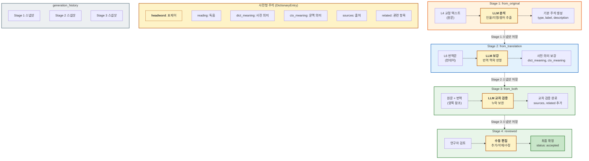

---

## 13. 추출 모드 — 논문 한 편의 경로

근현대 논문 스캔본에서 텍스트만 뽑아 **검색되는 PDF**로 내보내는 흐름.
D-055 · D-057 · D-062 · D-065 · D-067 · D-068이 여기에 모인다.

**여기서 읽어야 할 것**: 이 경로는 8층 모델을 우회하지 않는다.
L3(레이아웃)와 L2(OCR)를 그대로 거치되, 사람이 손대야 하던 자리를 기계가 채운다.
그리고 마지막에 「만든 것을 다시 열어 재는」 단계가 있다 —
글자가 조용히 사라지거나 엉뚱한 크기로 박히는 사고를 여기서 잡는다.

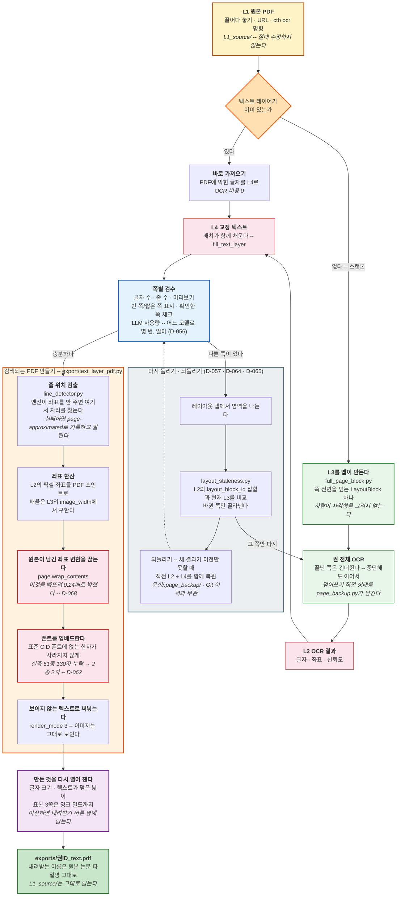

**이 경로가 지키는 약속:**
- 원본은 읽기만 한다 — `L1_source/`는 어떤 단계에서도 수정되지 않는다
- 만든 것은 믿지 않고 잰다 — 산출물을 다시 열어 글자 크기 · 덮개 · 잉크 밀도를 확인한다
- 되돌릴 수 있다 — 저장할 때마다 직전 한 벌을 남기므로 되돌리기는 언제나 「방금 저장한 것 취소」다
- 중단할 수 있다 — 끝난 쪽은 건너뛰므로 권 전체 OCR을 언제 멈춰도 이어서 돌아간다

**알려진 한계** (v1.2.0 릴리스 노트와 같음):
- 줄 위치 검출이 실패한 쪽은 텍스트가 원문 자리가 아닌 곳에 순서대로 놓인다.
  검색은 되지만 형광이 엉뚱한 데 뜬다
- 앱 안의 PDF 뷰어는 텍스트 레이어를 그리지 않는다.
  Ctrl+F는 내보낸 파일을 외부 뷰어에서 열 때 동작한다

---

## 부록: 설계 원칙 요약

| 원칙 | 설명 |
|------|------|
| **원본 불변** | L1 파일, raw_metadata, original_text — 수정 금지 |
| **모든 필드 Nullable** | 소스에 없는 필드는 비워두고 나중에 채운다 |
| **삭제 금지, 상태 전이만** | `draft → active → deprecated → archived` |
| **원문 비변형** | 표점/현토/번역은 글자 인덱스 오버레이. 원문은 그대로 |
| **매핑 투명성** | `_mapping_info`에 출처/신뢰도 기록 |
| **출처 추적** | `source_ref`로 원본 저장소 역참조 |
| **온톨로지 비강제** | Concept 자유 확장. 부재 = 미지정 |
| **Promotion Flow** | Tag(잠정) → Concept(확정), 연구자 판단 |
| **용어 규칙** | LayoutBlock / OcrResult / 단위(unit). 「Block」 단독 사용 금지 |
| **오프라인 퍼스트** | 핵심 작업(교정, 열람, 커밋)은 인터넷 없이 동작 |
| **작업 모드는 표시만 바꾼다** | 추출 모드는 탭·패널을 숨길 뿐, 저장 형식과 데이터는 교감 모드와 같다 (D-055) |
| **산출물은 다시 열어 잰다** | 만든 PDF를 앱이 열어 글자 크기·덮개·잉크 밀도를 확인한다 (D-068) |
| **덮어쓰기 전에 한 벌 남긴다** | 되돌리기는 언제나 「방금 저장한 것 취소」. 세대는 하나만 (D-065) |
| **JSON은 원자적으로 저장** | 임시 파일에 다 쓴 뒤 갈아 끼운다. 중간에 죽어도 빈 파일이 남지 않는다 (D-069) |

---
